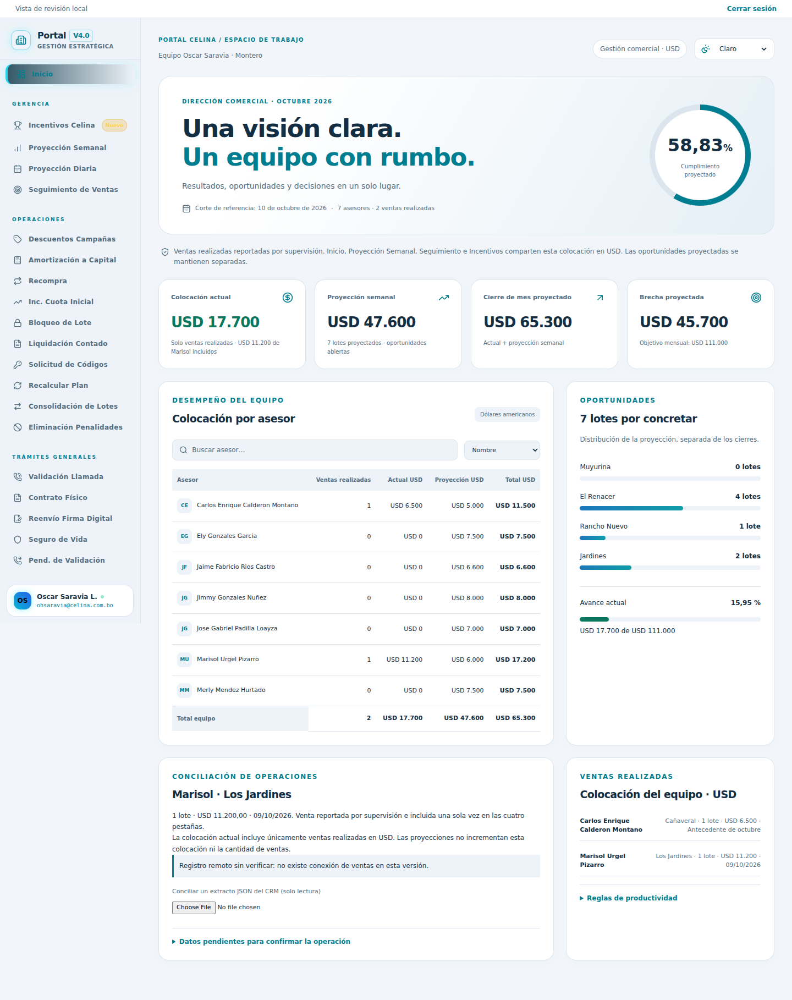
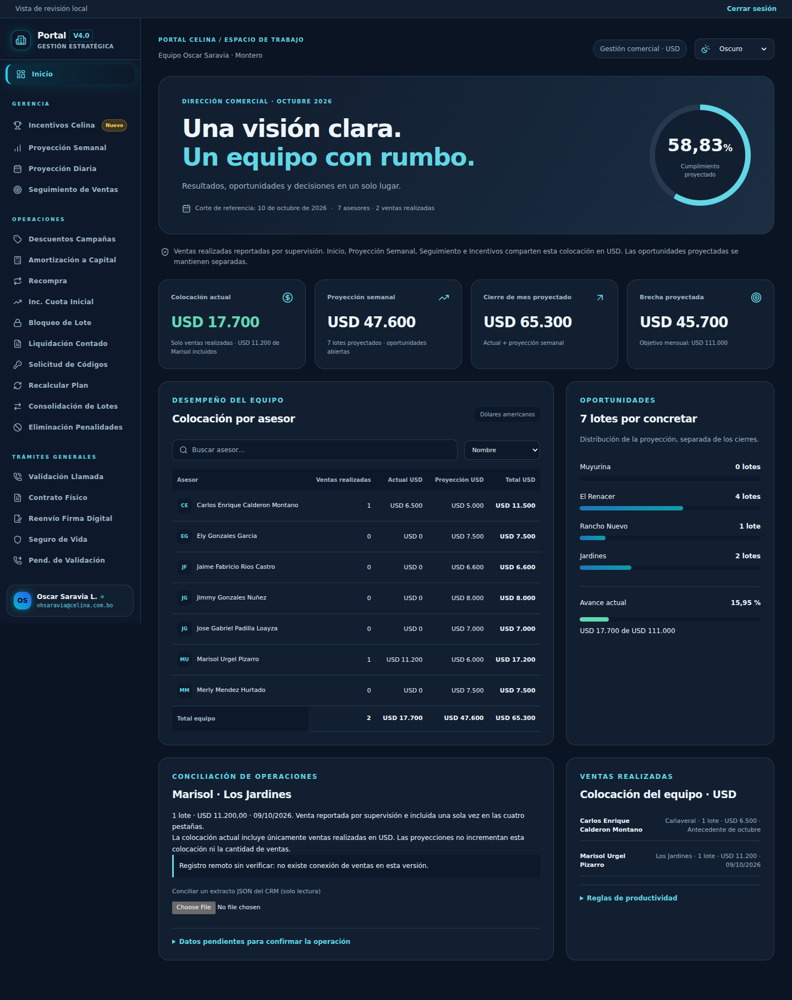
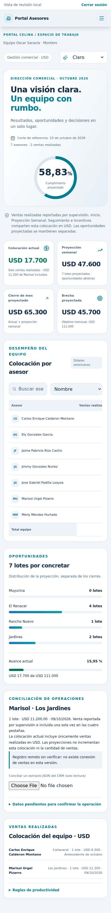
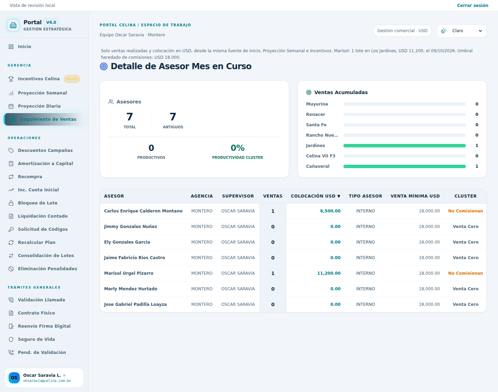
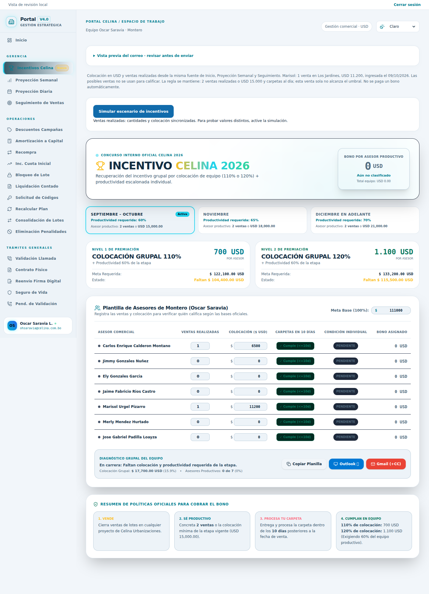

# Entrega V4.0

## Implementación

- Tema claro/oscuro/automático persistente, actualización al cambiar preferencia del dispositivo y tolerancia a almacenamiento bloqueado.
- Tokens de superficies, texto y bordes aplicados a todas las vistas; paleta azul/turquesa; tipografía del sistema, contraste y foco visible; tablas con desplazamiento móvil y movimientos reducidos.
- Dashboard ejecutivo: búsqueda y orden de asesores, tarjetas de resultados, cumplimiento, distribución de proyectos, historial de TC y conciliación de Marisol.
- Fuente central de referencia: 7 asesores, colocación USD 17.700, proyección USD 47.600 y meta USD 111.000.
- Proyección semanal: importes en USD; la proyección total se puede editar sin inventar fechas diarias ni atribuir lotes a asesores. Al editar un importe diario, se usa la suma diaria como nueva proyección; al editar el total semanal, se reinicia la distribución diaria. Los cambios son simulaciones en memoria.
- Correos: sustitución de tokens una sola vez, saludos con hora de Bolivia, corrección de redundancias/gramática, escape de variables, sanitización HTML y copia con manejo de errores. Vista previa también en Incentivos y Campañas. Abrir el cliente de correo continúa siendo una acción manual; no existe envío automático.
- TC: vigencia comercial centralizada; excepción de fin de semana; TC histórico explícito tiene prioridad. Campañas, utilidades de descuento, textos y liquidación consultan esa configuración para nuevas simulaciones.
- Corrección del conteo por proyecto en Seguimiento: Cañaveral se sumaba dos veces. La venta de Carlos se conserva como antecedente de la versión anterior; Marisol muestra la venta reportada en Los Jardines el 09/10/2026.
- Carga diferida de los 25 módulos y límite de errores por módulo. Navegación extraída fuera del render para evitar remontajes.
- Tailwind compilado localmente, sin CDN ni descarga de tipografías; package-lock reparado; workflow de verificación sin despliegue y con permisos de lectura.
- Firebase Auth reemplaza contraseña pública y bandera local. Claims de acceso verificadas, cierre de sesión y ausencia del bypass local en producción.

## Capturas del portal real

Las capturas se actualizaron tras confirmar USD y corresponden a la ejecución local de esta rama. No representan un inicio de sesión Firebase de producción.

## Pendientes antes de publicar

1. Administrador de Firebase: habilitar proveedor, dominios y claims para las cuentas autorizadas. No se probó una cuenta real ni se inspeccionaron reglas desplegadas. No fusionar hasta completar esa configuración.
2. Supervisor/CRM: aportar extracto verificable y contrato de Marisol; confirmar cliente, UV, manzano, lote, comprobante y estado. No hay endpoint de ventas utilizado por el código heredado.
3. Gerencia: confirmar base vigente fuera del 10–11/10 y cómo se relacionan los umbrales de productividad/comisiones. Los simuladores mantienen esquemas anteriores distintos de contado y crédito, sin sustituir políticas comerciales.
4. Revisión de negocio: probar escenarios de contratos reales en los simuladores de amortización, consolidación y recálculo. Las pruebas de navegación verifican carga y continuidad; no certifican todas las reglas contractuales posibles.

La rama conserva los cambios recientes de `main` en Campañas (TC y nombre del destinatario). No se escribió en `main`, en ventas definitivas ni se enviaron correos. La vista previa privada se publica por separado. No se llamó a proveedores de IA.

## Revisión final solicitada el 10/10/2026

- Marisol: 1 venta reportada en Los Jardines el 09/10/2026; Incentivos inicializado con USD 11.200. La moneda del cuadro general se confirmó en USD; todas las vistas comparten ventas realizadas y colocación.
- Gmail: una sola copia a `ohsaravia@celina.com.bo`, sin otras copias automáticas. Outlook: excluye la copia de supervisión y mantiene las copias operativas originales. Si el destinatario es supervisión, no se duplica como CC.
- Regla compartida de destinatarios y enlaces para ResultCard, Incentivos y Campañas, incluidos dispositivos móviles. Se eliminó la redirección temporizada de Gmail a un `mailto:` que podía abrir otro cliente.
- Revisión de redacción en las plantillas HTML/texto y correos independientes: tratamiento de usted, frases directas, singular/plural de beneficiarios, cierre corporativo y eliminación de afirmaciones no respaldadas sobre dos meses de incumplimiento.
- La autorización de publicar ya fue recibida. Para sustituir el portal vigente aún se necesita identificar su URL/proveedor y verificar una cuenta habilitada en Firebase. El repositorio solo enlaza un editor de StackBlitz, no identifica el destino de producción.

## Unificación comercial final en USD

Supervisión confirmó USD para colocación, proyecciones y meta. No se convirtieron los valores: se corrigió la moneda declarada. Registro único de ventas realizadas y estado compartido para Inicio, Proyección Semanal, Seguimiento e Incentivos. La edición de proyecciones se refleja en los indicadores proyectados de Inicio y se conserva durante la navegación; no afecta cantidad o colocación realizada.

Los valores realizados de Incentivos son de lectura. Se conserva un escenario editable explícito, separado de la fuente real; sus correos se identifican como simulación. No se añaden operaciones de prueba al CRM. El tipo de cambio solo aparece en las simulaciones de descuentos para clientes.

